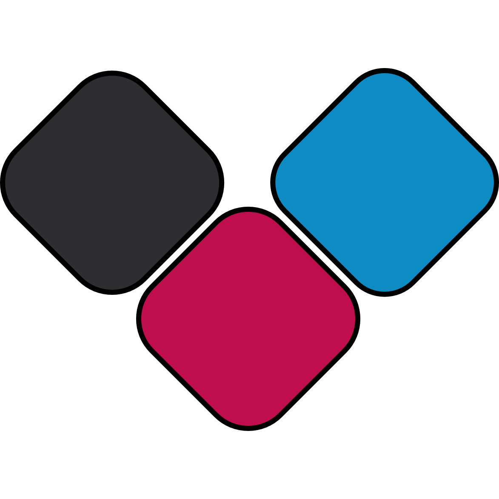

# Freedeck

  

*More than just a macropad; it's a Freedeck. The FOSS alternative to the Elgato Stream Deck.*

## Install from freedeck.app

The launcher automagically updates, keeps track of dependencies, and allows you to on-demand switch between the developer and stable branch. Alongside that, it also provides the native bridge capability, enabling control for system application volume and macros.

- Go to [https://freedeck.app](https://freedeck.app)
- Click "Get it? Get Freedeck."
- Run the installer, and configure Freedeck however you'd like!
- Click "Install" in the installer
- When it finishes, the installer will turn into the launcher for Freedeck.
- You're done! Check the Start menu for a shortcut.

The default installation location is `%APPDATA%\FreedeckApp`, and this repository is inside `FreedeckApp\freedeck`.

## Install from GitHub

This set of steps assumes you have a *minimum of* [Node.js v20+, npm v10+](https://nodejs.org/en/download/current) and [Git 2.4X+](https://github.com/git-for-windows/git/releases/tag/v2.55.0.windows.3) installed.

Although it's recommended you have npm v11+ and Node.js v24+ installed, any newer version should work too.

These are commands you'd run in the terminal (cmd, powershell, bash, etc.)

- Clone the repo
  - `git clone https://github.com/Freedeck/freedeck.git`
- Move into it
  - `cd freedeck`
- Download NPM packages
  - `npm i`
- Run Freedeck!
  - `npm run start`
- Enjoy!

## Usage

The moment you start Freedeck:

- a setup wizard will launch.
  - Follow the on-screen instructions.
- when the setup wizard closes, you'll see Companion.
  - It's like Step 2, you just pick your audio devices and then you're ready!

From there, Freedeck is ready to use.

## Uninstalling Freedeck

If you want to uninstall Freedeck, simply delete the `%APPDATA%\FreedeckApp` folder. To remove all traces from Electron, delete `%APPDATA%\freedeck` too. Finally, you can remove the Desktop and Start menu shortcuts. Thanks for trying Freedeck out!
